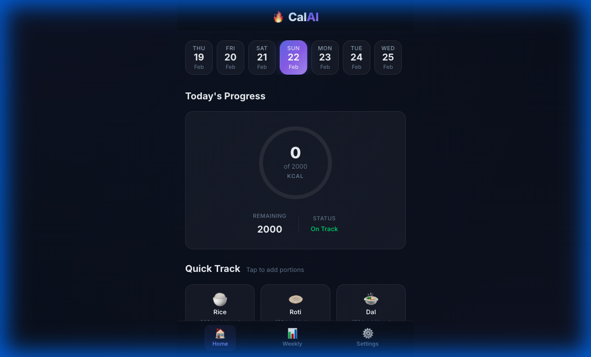
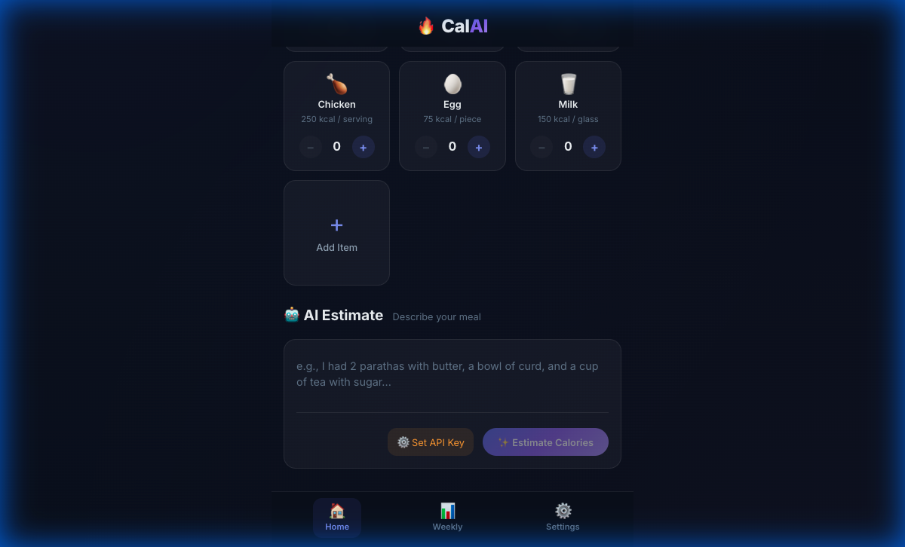
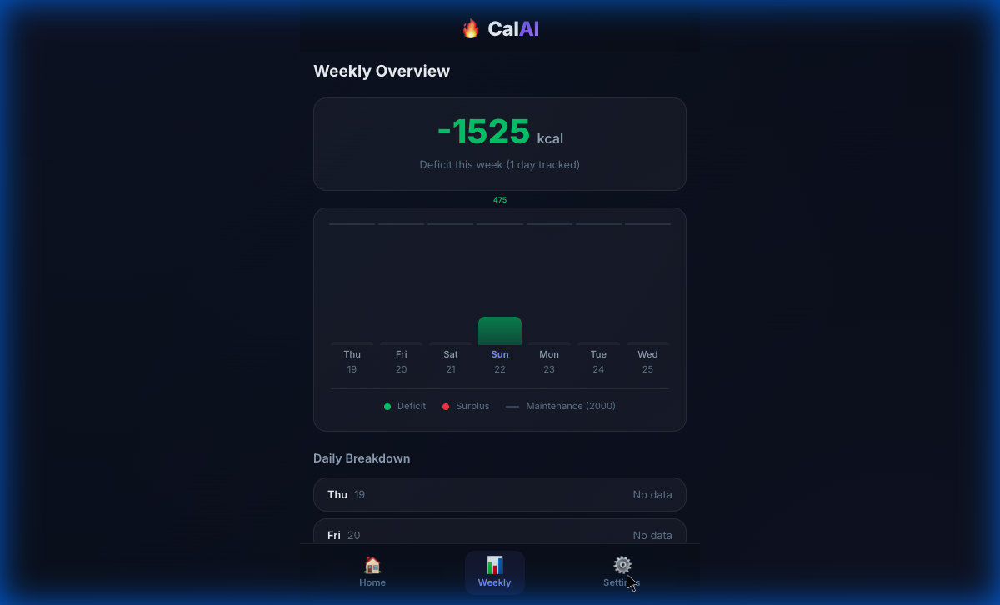

# 🔥 CalAI — AI-Powered Calorie Tracker

A modern, minimalist calorie tracking Progressive Web App (PWA) powered by **Groq LLM**. Track your daily meals through quick-add buttons and free-text AI-powered calorie estimation, with weekly deficit/surplus summaries.

<p align="center">
  
  
  
</p>

## ✨ Features

- **🎛️ Quick Track Buttons** — Customizable food buttons with +/− controls (name, emoji, calories, unit — all editable)
- **🤖 AI Calorie Estimation** — Describe any meal in natural language, get instant calorie breakdown via Groq LLM (LLaMA 3.3)
- **📊 Progress Dashboard** — Real-time SVG progress ring showing consumed vs. maintenance calories
- **📅 Date Navigation** — 7-day scrollable date strip, log calories for any day
- **📈 Weekly Summary** — Bar chart with deficit/surplus calculation across the week
- **💾 Persistent Storage** — All data saved in `localStorage`, stays on your device
- **📱 PWA Support** — Install on Android/iOS directly from Chrome, works offline
- **🌙 Dark Theme** — Modern glassmorphism UI with smooth animations
- **🔒 Privacy First** — No backend, no database. Your data never leaves your device

## 🚀 Getting Started

### Prerequisites
- [Node.js](https://nodejs.org/) (v18+)
- A free [Groq API Key](https://console.groq.com)

### Installation

```bash
# Clone the repo
git clone https://github.com/YOUR_USERNAME/CalAI.git
cd CalAI

# Install dependencies
npm install

# Start dev server
npm run dev
```

Open `http://localhost:5173` in your browser.

### Setup

1. Click **Settings** (⚙️) in the bottom nav
2. Enter your **Groq API Key** (get one free at [console.groq.com](https://console.groq.com))
3. Set your **Daily Calorie Target** (default: 2000 kcal)
4. Customize your **Quick Track Buttons** as needed

## 📱 Install as App (PWA)

No app store needed! Works on Android, iOS, and desktop:

1. **Deploy** to Netlify, Vercel, or any static host
2. Open the URL in **Chrome** on your phone
3. Tap the **3-dot menu → "Install app"** (or "Add to Home Screen")
4. Launches fullscreen like a native app 🎉

## 🏗️ Tech Stack

| Layer | Technology |
|-------|-----------|
| Framework | React 18 + Vite |
| Styling | Vanilla CSS + Glassmorphism |
| State | React Context + localStorage |
| AI | Groq API (LLaMA 3.3 70B) |
| PWA | vite-plugin-pwa + Workbox |
| Font | Inter (Google Fonts) |

## 📁 Project Structure

```
src/
├── context/
│   └── CalorieContext.jsx    # State management + localStorage
├── services/
│   └── groqService.js        # Groq LLM API integration
├── components/
│   ├── DateNavbar.jsx         # 7-day date navigation
│   ├── QuickButtons.jsx       # Customizable food buttons
│   ├── FoodInput.jsx          # AI meal estimation input
│   ├── CalorieDashboard.jsx   # Progress ring + today's log
│   ├── WeeklySummary.jsx      # Weekly bar chart
│   └── Settings.jsx           # Config & button management
├── App.jsx                    # Main shell + routing
├── App.css                    # Layout styles
├── main.jsx                   # Entry point
└── index.css                  # Design system & tokens
```

## 🔐 Privacy & Security

- **No backend** — All data stored locally in your browser
- **No tracking** — Zero analytics, zero telemetry
- **API key safety** — Your Groq key stays in `localStorage` on your device only
- **Encrypted calls** — API requests go directly from your browser to Groq via HTTPS

## 📄 License

MIT License — feel free to fork and customize!
